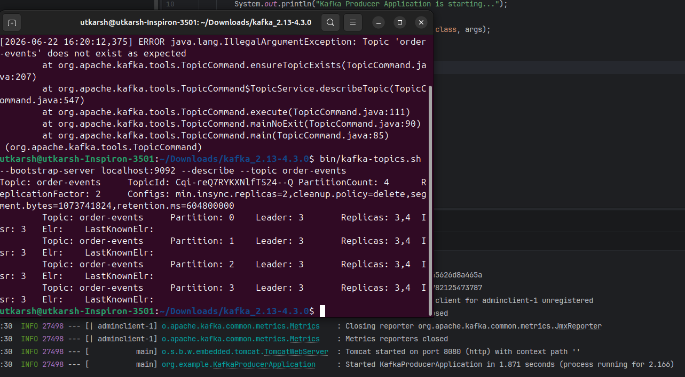

In code just had a main class to start the application and a KafkaConfig class which created the orderEvent topic bean.
So when I started the application, it created the topic with set partitions and replication factor. I could see it on CLI with describe topic command
